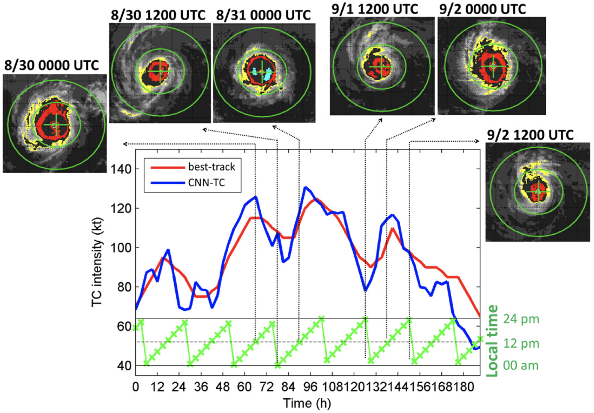
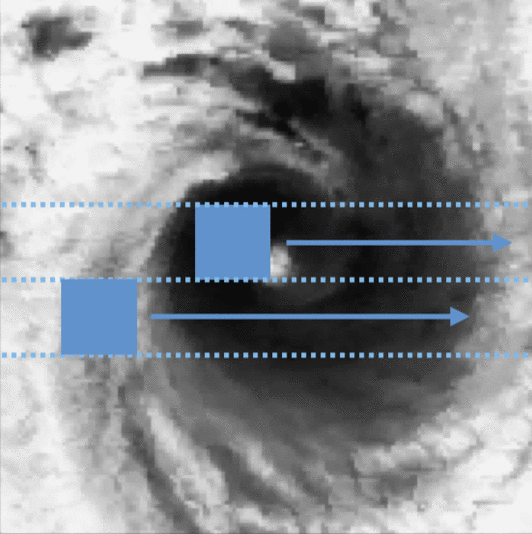
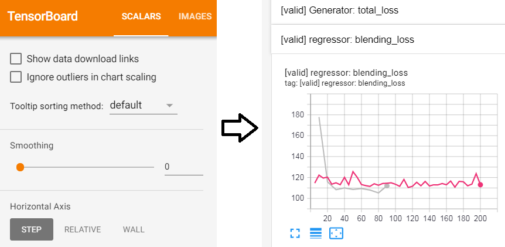

# DLTC

This repository is the work place for analyzing Tropical Cyclone with deep learning methods.
Three paper are covered:

### Estimating Tropical Cyclone Intensity by Satellite Imagery Utilizing Convolutional Neural Networks

Buo-Fu Chen, Boyo Chen, Hsuan-Tien Lin, Russell L. Elsberry

Weather and Forecasting 34 (2), 447-465



### Real-time Tropical Cyclone Intensity Estimation by Handling Temporally Heterogeneous Satellite Data

Boyo Chen, Buo-Fu Chen, Yun-Nung Chen

AAAI 2021


### CNN Profiler on Polar Coordinate Images for Tropical Cyclone Structure Analysis

Boyo Chen, Buo-Fu Chen, Chun-Min Hsiao

AAAI 2021




## Requirements

To install requirements:

0. install pipenv (if you don't have it installed yet)
```setup
pip install pipenv
```
1. use pipenv to install dependencies:
```
pipenv install
```
2. install tensorflow **in the** pipenv shell
(choose compatible tensorflow version according to your cuda/cudnn version)
```
pipenv run pip install tensorflow
pipenv run pip install tensorflow_addons
```

## Training

To run the experiments, run this command:

```train
pipenv run python main.py <experiment_path>

<experiment_path>:

# CNN intensity estimation
experiments/regressor_experiments/reproduce_CNN-TC.yml

# CNN-GAN intensity estimation
experiments/GAN_experiments/five_stage_training_fix_target_m2n.yml

# polar CNN size estimation
experiments/regressor_experiments/polar_coordinate/polar_coordinate_R34.yml
```

***Notice that on the very first execution, it will download and extract the dataset before saving it into a folder "TCIR_data/".
This demands approximately 80GB space on disk as well as about 20 min preprocessing time, please be patient. :D***

### Some usful aguments

#### To limit GPU usage
Add *GPU_limit* argument, for example:
```args
pipenv run python train main.py <experiment_path> --GPU_limit 3000
```

#### Continue from previous progress
An experiemnt is divided into several sub_exp's.
For example, a *five_stage_training* experiment comprise 5 sub-exp's.

Once the experiemnt get interrupted, we probably want to continue from the completed part.
For example, when the *five_stage_training* experiment get interrupted when executing sub-exp #3 (*pretrain_regressor_all_data_stage*), we want to restart from the beginning of sub-exp #3 instead of sub-exp #1.

We can do this to save times:

1. Remove partially done experiment's log.
```
rm -r logs/five_stage_training/pretrain_regressor_all_data_stage/ 
```

2. Restart experiment with argument: *omit_completed_sub_exp*.
```
pipenv run python train main.py experiments/GAN_experiments/five_stage_training.yml --omit_completed_sub_exp
```

## Evaluation

All the experiments are evaluated automaticly by tensorboard and recorded in the folder "logs".
To check the result:

```eval
pipenv run tensorboard --logdir logs

# If you're running this on somewhat like a workstation, you could bind port like this:
pipenv run tensorboard --logdir logs --port=1234 --bind_all
```

Curves can be obtained from the **[valid] regressor: blending_loss** in the scalar tab.


